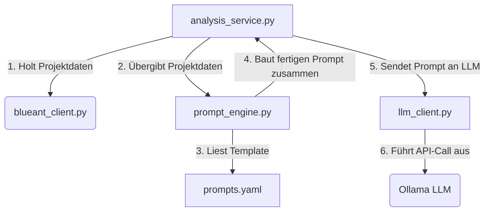

# Blue Ant KI Portfolio-Dashboard (AP2 & AP3)

Dieses Projekt ist eine integrierte, containerisierte Webanwendung zur intelligenten Analyse von Projekt- und Portfolio-Daten aus dem Projektmanagementsystem **Blue Ant** mittels lokaler/universitärer **Ollama LLM (Large Language Model) Instanzen**. 

Es vereint das **Arbeitspaket 2 (AI Core & Prompt-Management Engine)** und das **Arbeitspaket 3 (Problem-Manager Dashboard & UI)** zu einem funktionalen, sicheren und optisch ansprechenden System.

---

## 📂 Systemarchitektur & Datenfluss

Das System wurde nach modernen Software-Design-Richtlinien modular und lose gekoppelt aufgebaut. 

Das folgende Ablaufdiagramm beschreibt den Datenfluss bei einer Portfolio- bzw. Projektanalyse:



*(Ein entsprechendes Ablaufdiagramm befindet sich auch als Bild/Screenshot in dieser Dokumentation).*

---

## ⚡ Hauptfeatures & Funktionsumfang

### Arbeitspaket 2: AI Core (Backend-Services)
1. **Sicheres Token-Handling**: API-Keys (Blue Ant & Ollama) werden nicht auf dem Server-Laufwerk abgelegt, sondern liegen verschlüsselt im Local Storage des Browsers. Sie werden bei Anfragen per HTTP-Header an das Backend übermittelt.
2. **Zero-Spam Cache-Schutz**: Um das Abfragenlimit der Blue Ant API zu schonen, verfügt der `BlueAntClient` über ein intelligentes In-Memory-Caching (Standard: 10 Minuten Gültigkeit).
3. **Dynamisches Prompt-Engineering**: Systemanweisungen und Analysemuster sind in der Datei `prompts.yaml` definiert. Sie werden bei Änderungen in Echtzeit über ein Hot-Reload-Verfahren eingelesen – **ohne Server-Neustart**.
4. **Ausfallsicheres Fallback-System**: Sollte der Ollama-KI-Server nicht erreichbar sein oder ein Timeout auftreten, greift ein mathematisch-regelbasiertes Fallback-System. Es berechnet alle Kennzahlen, Aufwandsabweichungen und Statusampeln direkt aus den Blue Ant-Rohdaten.
5. **Concurrency Management**: Parallele Analyseanfragen für mehrere Projekte werden über ein Semaphor (`asyncio.Semaphore(3)`) gedrosselt, um eine Überlastung der KI-Infrastruktur zu verhindern.

### Arbeitspaket 3: Problem-Manager Dashboard (Frontend-UI)
1. **Modernes UI/UX-Design**: Maßgeschneidertes, responsives Dark-Mode-Design im edlen Glassmorphismus-Look (Outfit-Schriftart, harmonische Ampelfarben, interaktive Hover-Effekte).
2. **Datenvisualisierung (Chart.js)**: 
   - Ein Doughnut-Chart zeigt die proportionale Statusampel-Verteilung des Portfolios (Grün / Gelb / Rot).
   - Ein gruppiertes Säulendiagramm stellt den Plan- vs. Ist-Aufwand der einzelnen Projekte vergleichend in Stunden dar.
3. **Projekt-Detailbewertung (Modal-Popup)**: Der Klick auf eine Tabellenzeile öffnet ein detailliertes Analysefenster mit Zeitplanprognosen, prognostiziertem Gesamtaufwand, Zielkonformität, kritischen Warnsignalen und einer Zusammenfassung aller Memos (Status, Gegenstand, Probleme).
4. **Live Prompts-Editor**: Ein integrierter Editor erlaubt es, die Prompt-Templates zur Laufzeit direkt über die Oberfläche anzupassen.
5. **Systemeinstellungen**: Verwaltung der Basis-URLs für den Blue Ant- und Ollama-Server sowie Steuerung von Cache-Gültigkeit und Timeouts.
6. **Vollständige deutsche Übersetzung**: Alle Buttons, Tabellen, Tooltips und selbst System-Fehlermeldungen sind vollständig auf Deutsch übersetzt.

---

## 🛠️ Technologien & Bibliotheken

* **Backend**: Python 3.10, FastAPI, Uvicorn, HTTPX, PyYAML
* **Frontend**: HTML5, CSS3 (Vanilla CSS variables), Javascript (Vanilla ES6), Chart.js, FontAwesome 6
* **Infrastruktur & QA**: Docker, Docker Compose, Python Unittest

---

## 🚀 Installation & Inbetriebnahme (Docker)

### Voraussetzungen
* Installiertes **Docker Desktop** auf Ihrem System.

### Starten der Anwendung
1. Klonen oder kopieren Sie das Projektverzeichnis auf Ihren Rechner.
2. Öffnen Sie ein Terminal (PowerShell / CMD) im Projektordner.
3. Starten Sie den Docker-Container mit folgendem Befehl:
   ```bash
   docker compose up --build -d
   ```
4. Die Anwendung ist nun unter **`http://localhost:8000`** in Ihrem Browser erreichbar.

---

## ⚙️ Einrichtung der API-Verbindung

Um die echten Daten Ihrer Hochschule anzuzeigen, müssen Sie das Dashboard konfigurieren:

1. **Server-URL einstellen**:
   - Gehen Sie im Dashboard in den Tab **"Einstellungen"**.
   - Tragen Sie als **Blue Ant Service-Basis-URL** die Adresse Ihrer Hochschule ein (z. B. `https://hs.cluster.proventis.info/rest`).
   - Passen Sie ggf. die **Ollama-Verbindung** an (z. B. `http://hpc-node:11434` und den Modellnamen wie `llama3`).
   - Klicken Sie auf **"Einstellungen speichern"**.

2. **API-Schlüssel hinterlegen**:
   - Klicken Sie oben rechts auf **"API-Schlüssel festlegen"**.
   - Fügen Sie Ihren persönlichen **Blue Ant REST API-Token** (aus Ihren Profileinstellungen in Blue Ant) und optional den **Ollama-API-Schlüssel** ein.
   - Klicken Sie auf **"Schlüssel speichern"**.

---

## 🧪 Automatisierte Tests ausführen

Zur Qualitätssicherung wurde eine Test-Suite mit 9 Integrations- und Modultests implementiert. Diese verifizieren die Konfigurationsdaten, das Caching, die Prompt-Generierung und alle FastAPI-Endpunkte.

Führen Sie die Tests direkt in Ihrer lokalen Python-Umgebung aus:

```bash
python -m unittest tests/test_analysis.py
```
